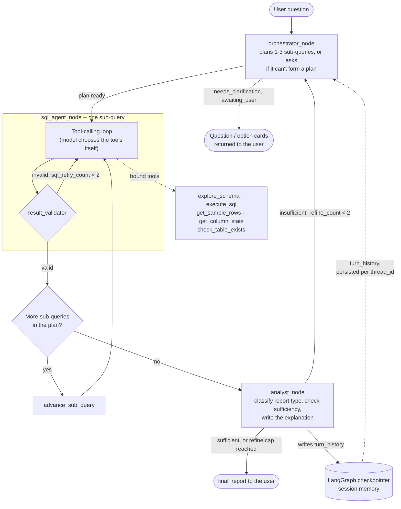

# Data Analyst Agentic System

LangGraph implementation of the design in `docs/text_to_sql_agent_design_spec.md`.
Natural-language questions in, plain-English answers out, against the Chinook
SQLite database -- no SQL ever shown to the user.

## Architecture



Two things worth noting that aren't obvious from the diagram:

- **The tool-calling loop is genuinely agentic.** The model decides which of
  the five bound tools to call, in what order, and when it has enough
  information to commit to a query -- it isn't a fixed
  explore-then-generate pipeline. `result_validator` is a separate,
  deterministic sanity check that runs *after* the model is done, on purpose:
  defense in depth against a confidently-wrong tool-calling agent.
- **Three nested budgets keep it bounded**, since sub-query count, tool-calling
  freedom, and analyst refinement all multiply each other:
  `sql_retry_count` (max 2, per sub-query, failed `execute_sql` calls only),
  `tool_call_count` (max 6, per sub-query, every tool call), and
  `total_tool_calls` (max 24, whole turn, the real backstop -- see spec §8).

Session memory (`active_filters`, `last_metric`, `turn_history`) lives
directly in `AgentState` and is persisted automatically by LangGraph's own
checkpointer, keyed by `session_id` -- there's no separate memory store to
keep in sync.

## Local setup

Requires Python 3.11+ (built and tested on 3.14).

```bash
git clone <this repo>
cd Data-Analyst-Agent

python -m venv .venv
.venv/Scripts/activate        # source .venv/bin/activate on macOS/Linux

pip install -r requirements.txt

cp .env.example .env
# edit .env and set ANTHROPIC_API_KEY=sk-ant-...
```

The Chinook database is already checked in at `db/chinook.db` (downloaded from
[lerocha/chinook-database](https://github.com/lerocha/chinook-database)) --
nothing else to provision.

### Model provider

Defaults to Anthropic. To use Groq instead, set in `.env`:

```
LLM_PROVIDER=groq
GROQ_API_KEY=gsk_...
```

Pick a Groq model that actually supports tool-calling (the SQL agent's whole
loop depends on it) -- `llama-3.3-70b-versatile` is the default; not every
model Groq hosts supports tools. `agent/llm.py` is the only file that knows
about provider differences; everything else uses the same LangChain interface
regardless of which one is active.

Note from live testing: Groq's smaller/faster models are noticeably more
variable than Claude here -- e.g. correctly aggregating `SUM(Total) GROUP BY
CustomerId` but never joining to `Customer` for a human-readable name, or
occasionally exhausting `sql_retry_count` on a query Claude gets first try.
The harness (retries, budgets, graceful failure) handles this correctly either
way; it's a model-quality difference, not a bug -- exactly what
`eval/run_eval.py`'s execution-accuracy check is there to catch.

## Running it

```bash
streamlit run streamlit_app.py               # chat UI, in the browser
python main.py                               # interactive REPL
python main.py "total revenue this quarter"  # single-shot mode
```

`streamlit_app.py` is a chat interface over the same graph (built once and
cached across the server process via `@st.cache_resource`; each browser tab
gets its own session via a random `thread_id`, same isolation mechanism as
the CLI). Missing filters show up as a question; a vague-intent clarification
renders as clickable option buttons instead of typed text. Use "New session"
in the sidebar to drop memory and start a fresh conversation without
restarting the server.

## Testing

```bash
pytest                    # 102 tests, all runnable without an API key
python -m eval.run_eval   # full gold-question eval suite -- needs a real API key
```

Everything under `tests/unit/` and most of `tests/integration/` runs against
the real `db/chinook.db` but with the LLM calls stubbed out (see
`tests/integration/test_sql_agent_budgets.py` and `test_multi_query_graph.py`
for how the tool-calling loop and the multi-sub-query graph are tested
without hitting a real model). `eval/run_eval.py` is the one thing that
genuinely needs a configured provider, since it drives the actual agent.

## Known simplification vs. the spec

The "ask and wait" clarification flow doesn't use LangGraph's `interrupt()`/resume
machinery. Instead, when a turn ends with `status == "awaiting_user"`, the CLI
prints the question, and the *next* user message is concatenated onto the
original query (`"<original> -- <answer>"`) and run through `orchestrator_node`
again from scratch. Simpler to reason about, and it's fine for a CLI REPL;
a real multi-turn UI would want the proper interrupt/resume flow instead.

## Project layout

See `docs/text_to_sql_agent_design_spec.md` §13 -- the code follows that
structure, with two exceptions: `agent/tools/db_tools.py` also holds
`is_select_query`/`classify_sql_error` and validation lives alongside the
loop in `agent/nodes/sql_agent.py` rather than a separate module, and there's
a `streamlit_app.py` at the repo root alongside `main.py` -- a second, thin
front end over the same `agent/graph.py`, not part of the original spec.
